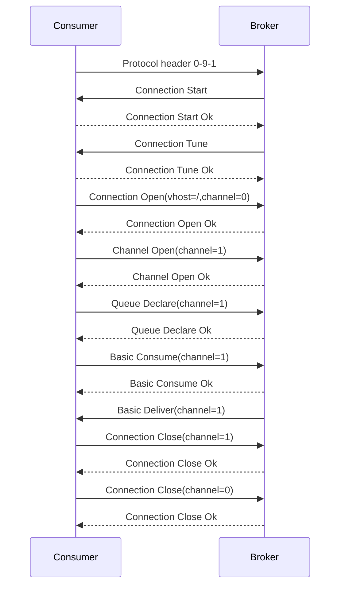

```mermaid
sequenceDiagram
    participant C as Consumer
    participant B as Broker
    C ->> B: Protocol header 0-9-1
    B ->> C: Connection Start
    C -->> B: Connection Start Ok
    B ->> C: Connection Tune
    C -->> B: Connection Tune Ok
    C ->> B: Connection Open(vhost=/,channel=0)
    B -->> C: Connection Open Ok
    C ->> B: Channel Open(channel=1)
    B -->> C: Channel Open Ok
    C ->> B: Queue Declare(channel=1)
    B -->> C: Queue Declare Ok
    C ->> B: Basic Consume(channel=1)
    B -->> C: Basic Consume Ok
    B ->> C: Basic Deliver(channel=1)
    C ->> B: Connection Close(channel=1)
    B -->> C: Connection Close Ok
    C ->> B: Connection Close(channel=0)
    B -->> C: Connection Close Ok
```
