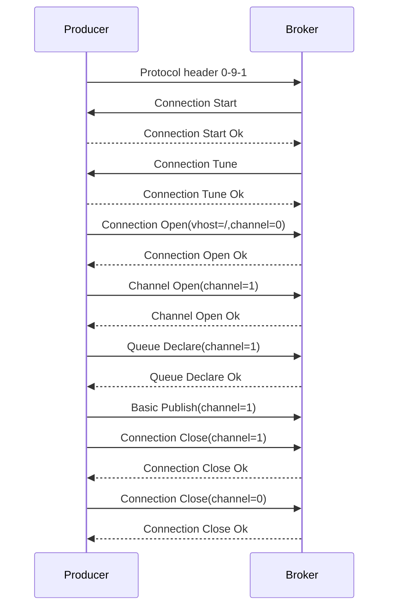

```mermaid
sequenceDiagram
    participant P as Producer
    participant B as Broker
    P ->> B: Protocol header 0-9-1
    B ->> P: Connection Start
    P -->> B: Connection Start Ok
    B ->> P: Connection Tune
    P -->> B: Connection Tune Ok
    P ->> B: Connection Open(vhost=/,channel=0)
    B -->> P: Connection Open Ok
    P ->> B: Channel Open(channel=1)
    B -->> P: Channel Open Ok
    P ->> B: Queue Declare(channel=1)
    B -->> P: Queue Declare Ok
    P ->> B: Basic Publish(channel=1)
    P ->> B: Connection Close(channel=1)
    B -->> P: Connection Close Ok
    P ->> B: Connection Close(channel=0)
    B -->> P: Connection Close Ok
```
