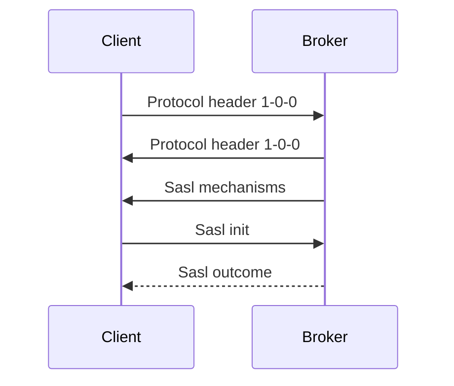

```mermaid
sequenceDiagram
    participant C as Client
    participant B as Broker
    C ->> B: Protocol header 1-0-0
    B ->> C: Protocol header 1-0-0
    B ->> C: Sasl mechanisms
    C ->> B: Sasl init
    B -->> C: Sasl outcome
```
