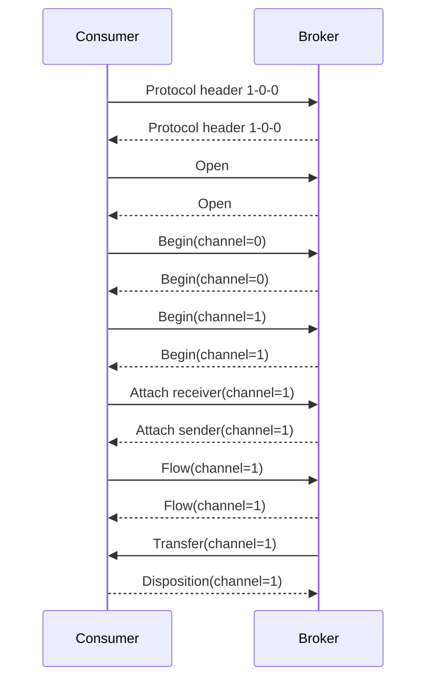

```mermaid
sequenceDiagram
    participant C as Consumer
    participant B as Broker
    C ->> B: Protocol header 1-0-0
    B -->> C: Protocol header 1-0-0
    C ->> B: Open
    B -->> C: Open
    C ->> B: Begin(channel=0)
    B -->> C: Begin(channel=0)
    C ->> B: Begin(channel=1)
    B -->> C: Begin(channel=1)
    C ->> B: Attach receiver(channel=1)
    B -->> C: Attach sender(channel=1)
    C ->> B: Flow(channel=1)
    B -->> C: Flow(channel=1)
    B ->> C: Transfer(channel=1)
    C -->> B: Disposition(channel=1)
```
