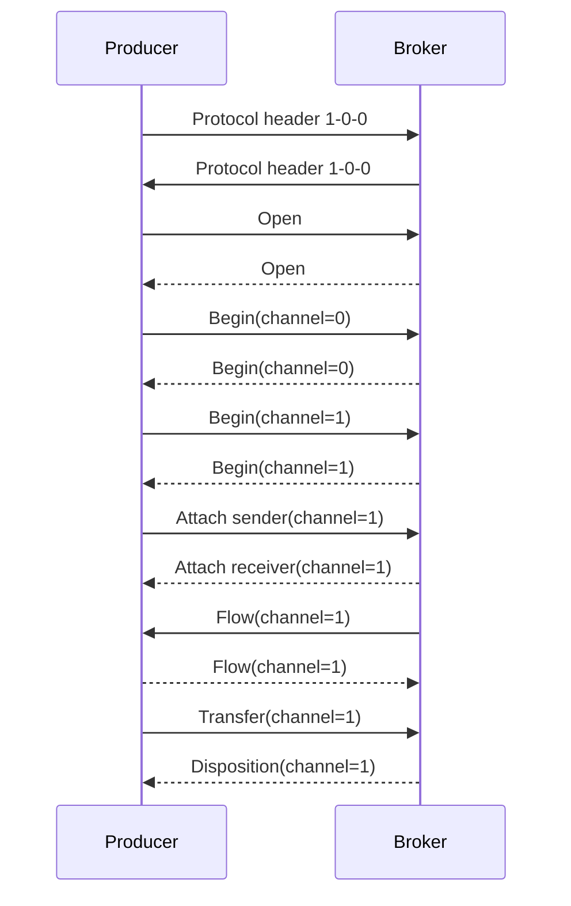

```mermaid
sequenceDiagram
    participant P as Producer
    participant B as Broker
    P ->> B: Protocol header 1-0-0
    B ->> P: Protocol header 1-0-0
    P ->> B: Open
    B -->> P: Open
    P ->> B: Begin(channel=0)
    B -->> P: Begin(channel=0)
    P ->> B: Begin(channel=1)
    B -->> P: Begin(channel=1)
    P ->> B: Attach sender(channel=1)
    B -->> P: Attach receiver(channel=1)
    B ->> P: Flow(channel=1)
    P -->> B: Flow(channel=1)
    P ->> B: Transfer(channel=1)
    B -->> P: Disposition(channel=1)
```
