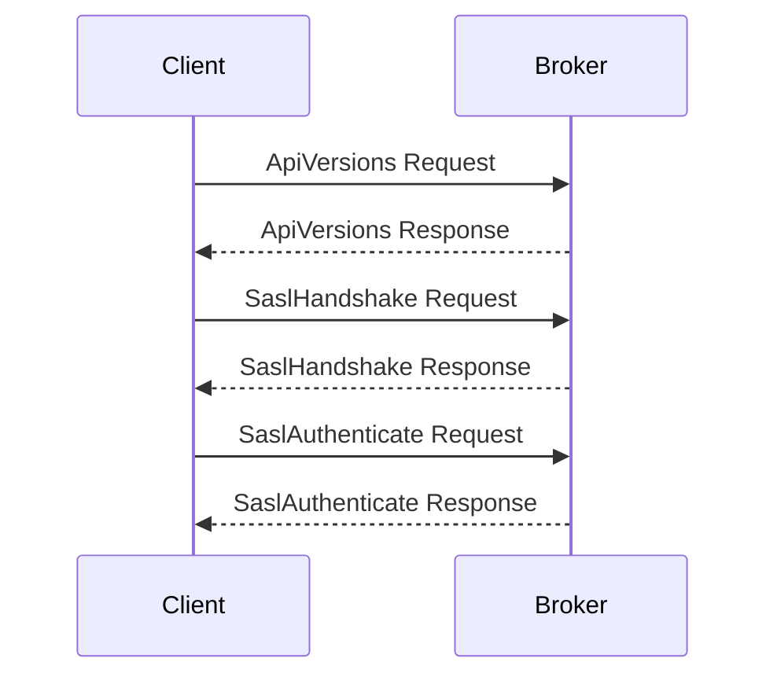

```mermaid
sequenceDiagram
    participant C as Client
    participant B as Broker
    C ->> B: ApiVersions Request
    B -->> C: ApiVersions Response
    C ->> B: SaslHandshake Request
    B -->> C: SaslHandshake Response
    C ->> B: SaslAuthenticate Request
    B -->> C: SaslAuthenticate Response
```
