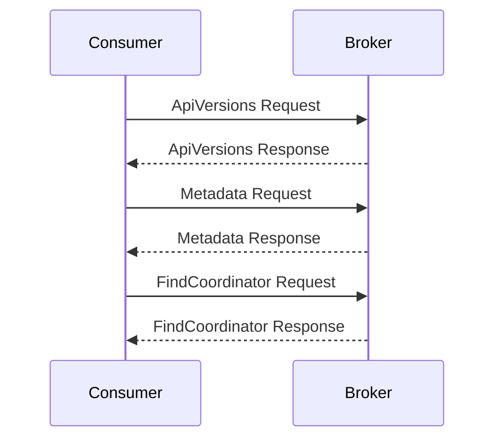
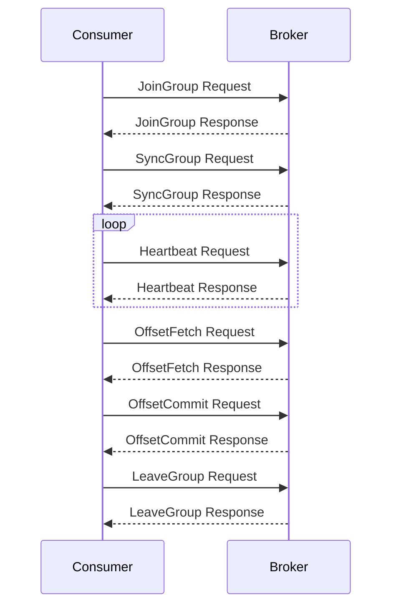
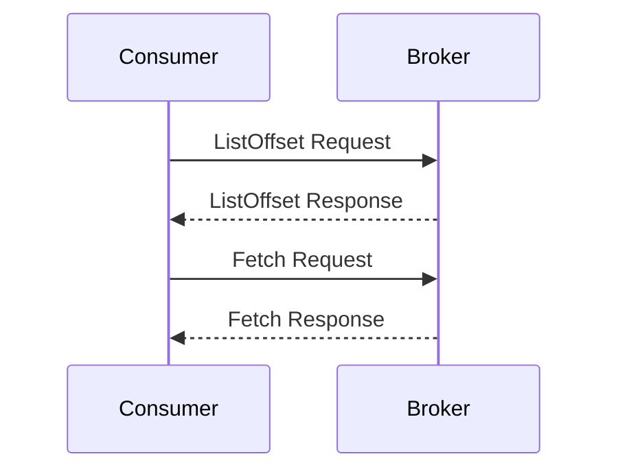

## kafka 2.4.0 consumer subscribe and pool sequence

Below is three sequence diagram for kafka consumer subscribe, poll and commit.

```mermaid
sequenceDiagram
    participant C as Consumer
    participant B as Broker
    C ->> B: ApiVersions Request
    B -->> C: ApiVersions Response
    C ->> B: Metadata Request
    B -->> C: Metadata Response
    C ->> B: FindCoordinator Request
    B -->> C: FindCoordinator Response
```

```mermaid
sequenceDiagram
    participant C as Consumer
    participant B as Broker
    C ->> B: JoinGroup Request
    B -->> C: JoinGroup Response
    C ->> B: SyncGroup Request
    B -->> C: SyncGroup Response
    loop
        C ->> B: Heartbeat Request
        B -->> C: Heartbeat Response
    end
    C ->> B: OffsetFetch Request
    B -->> C: OffsetFetch Response
    C ->> B: OffsetCommit Request
    B -->> C: OffsetCommit Response
    C ->> B: LeaveGroup Request
    B -->> C: LeaveGroup Response
```

```mermaid
sequenceDiagram
    participant C as Consumer
    participant B as Broker
    C ->> B: ListOffset Request
    B -->> C: ListOffset Response
    C ->> B: Fetch Request
    B -->> C: Fetch Response
```
